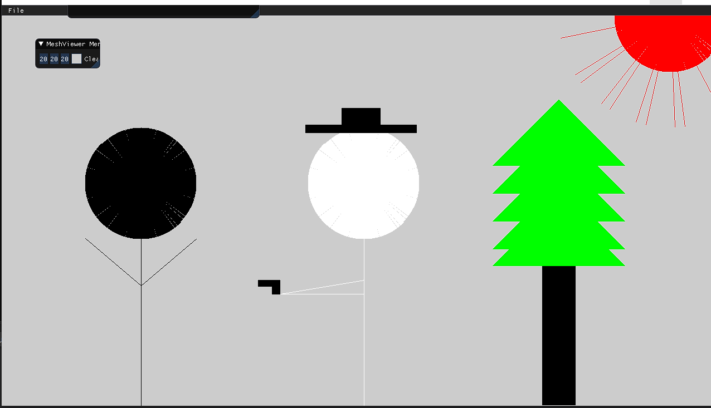
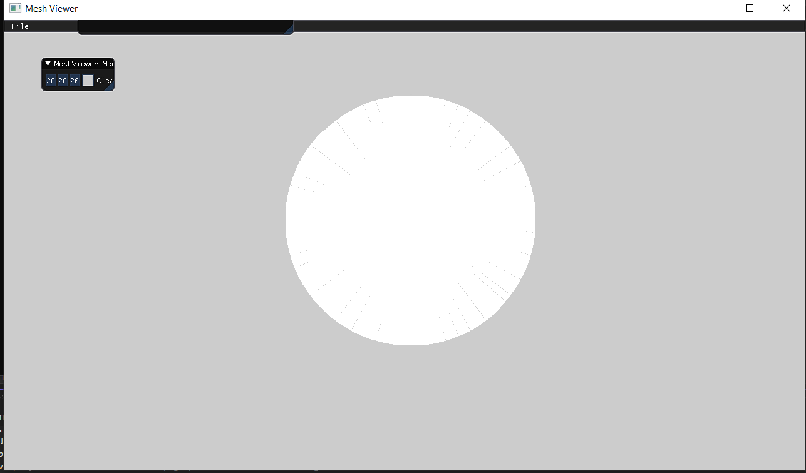

```
void Renderer::DrawLine(const glm::ivec2& p1, const glm::ivec2& p2, const glm::vec3& color, int flag)
{

	int x1 = p1.x, x2 = p2.x, y1 = p1.y, y2 = p2.y;
	int dx = x2 - x1;
	int dy = y2 - y1;
	int start_point, end_point, point_toadd, delta_1, delta_2;
	//in case we need to incerment x every iteration
	if (!flag)
	{
		start_point = x1;
		end_point = x2;
		delta_1 = dx;
		point_toadd = y1;
		delta_2 = dy;
	}
	//in case we need to incerment y every iteration
	else
	{
		start_point = y1;
		end_point = y2;
		delta_1 = dy;
		point_toadd = x1;
		delta_2 = dx;
	}
	int e = -delta_1;
	int to_add = 1;
	//check if we need to reflect
	if (delta_2 < 0)
	{
		delta_2 = -delta_2;
		to_add = -1;
	}
	while (start_point < end_point)
	{
		if (e > 0)
		{
			point_toadd = point_toadd + to_add;
			e = e - 2 * delta_1;
		}
		//check that we put pixel correctly(x should be first cordinate and y second)
		if (!flag)
			PutPixel(start_point, point_toadd, color);
		else
			PutPixel(point_toadd, start_point, color);

		e = e + 2 * delta_2;
		start_point++;
	}
}

void Renderer::ChangePoints(const glm::ivec2& p1, const glm::ivec2& p2, const glm::vec3& color)
{
	int dx = p2.x - p1.x, dy = p2.y - p1.y;
	if (dx < 0)
		dx = -dx;
	if (dy < 0)
		dy = -dy;
	//in this case A is from 0 to 1 or 0 to -1
	if (dy < dx)
	{
		//check if we need to draw from left to right or rigt to left
		if (p2.x < p1.x)
			DrawLine(p2, p1, color, 0);
		else
			DrawLine(p1, p2, color, 0);
	}
	//same as last one but for A bigger than 1 or lesser than -1
	else
	{
		if (p2.y < p1.y)
			DrawLine(p2, p1, color, 1);
		else
			DrawLine(p1, p2, color, 1);
	}
}
```

