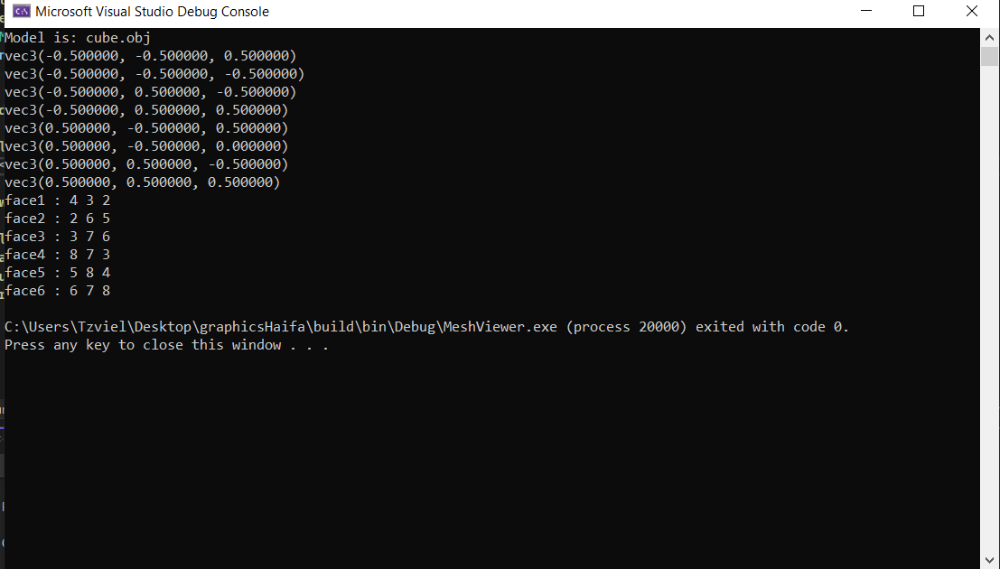
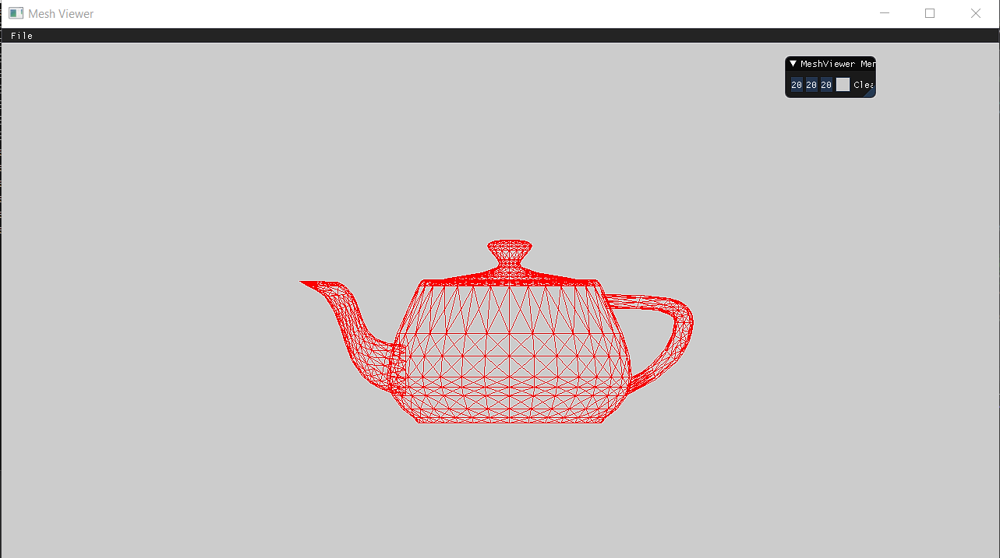
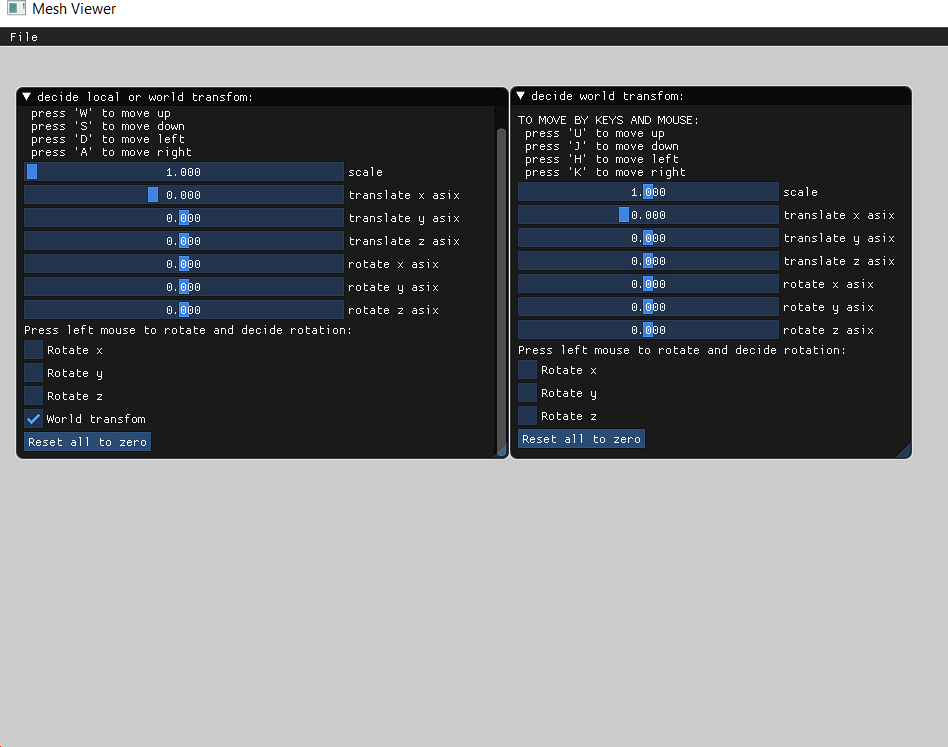
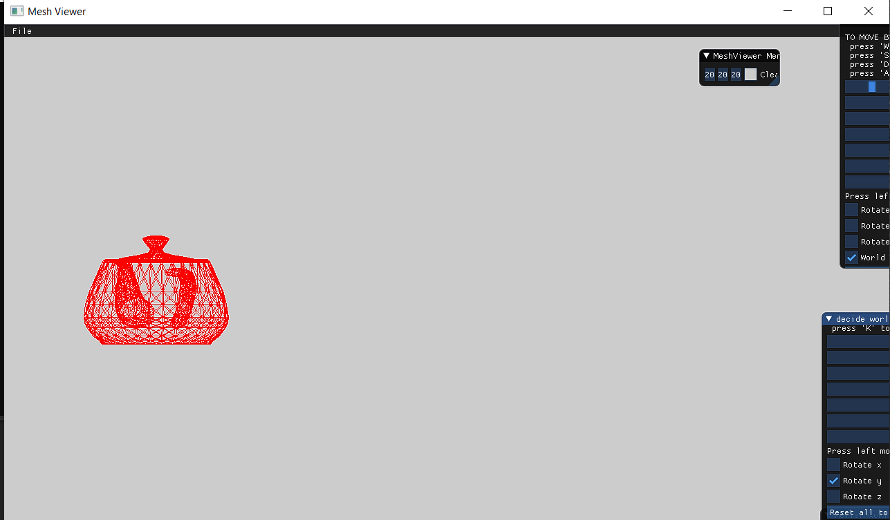
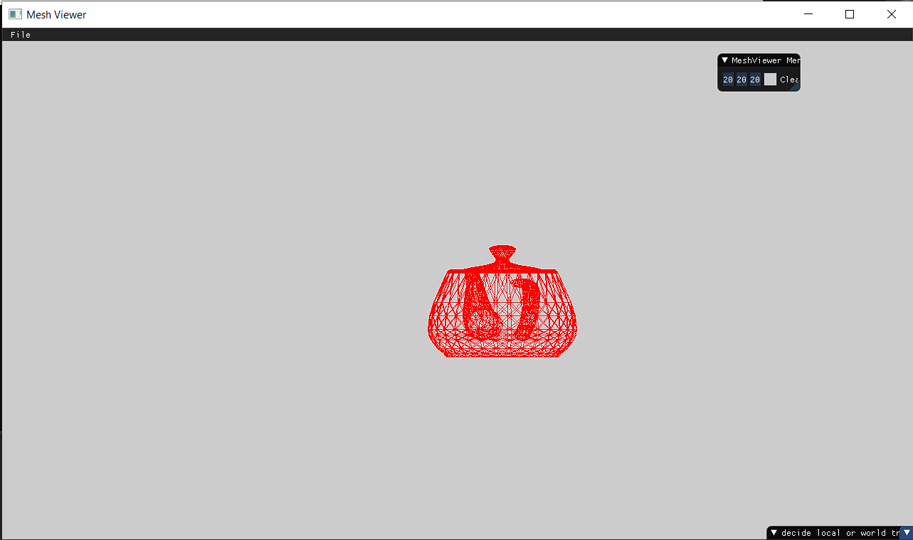

----------------------------------------part 1----------------------------------------------------------------

here is the output of the vertices and faces of the simple model of "cube" i saw at lecture:

----------------------------------------part 2+3----------------------------------------------------------------

To move the model to place where we can see it on screen i have preformed a transformation on the model like this:
i set 4x4 scale matrix by using glm::Scale and scaled all model's axes by 80,than i set up 4x4 translation matrix 
by using glm::tanslate, and translated model to x=635 and y=330. 
finally i set up matrix called localtransformation that was deftined like this:
localtransformation=translatemat*scalemat*rotate
the multipication of the each vertex was like this , vertex=localtranslationmat*vertex=translatemat*scalemat*rotate*vertex.
after this we could clearly see the model.

----------------------------------------part 4+7----------------------------------------------------------------

Gui:
The user interface works like this:
the user can control independently the localtransformation of the model and the worldtransformation of the model.
by using mouse(left click) the user can rotate the model in respect to x asix y asix or z asix, in the interface there 
are 3 check boxes "rotate 'asix'" by clicking one or more of them the user can decide rotation.
similar to this there is options to conatrol translation and scale.
we can use "W,A,S,D" or "U,H,J,K" to control local translation or world translation. 
Other option to controll this is to use the sliders(witch we also use for scalling).
For example by using sliders, we can move scale to 5 translae x to 650, traslate y to 350 and add some rotatin and this
will update the model's trasformation.
Here is explanation of how the sliders change actually the transformation:

each model has 3 matrixes representing rotation scale and translation matrixes,and also each model holds 2 glm::vec3(reperesenting x,y,z for rotation and translate) holding the "running parameters" ,when the user moves the sliders i update the vectoros acorrdingly and by this vectors i update rotation and 
translation using glm::rotate,glm::translate, and i have  a single float "scalex" used to update scale matrix.
when i want to get the updated transformation of the object, i return the following matrix multiplication: 
worldTransformation*localtransformation= worldTranslate * worldScale * worldRotation * localTranslate * localScale * localRotation and multiply the result matrix to each of the model's vertecis.
Also i have "reset all to zero" bottom to easly return the model to initial position.

----------------------------------------part 5----------------------------------------------------------------

Here is localtranslation of x by 100 than world rotation in respect of y by 74:

Here is worldranslation of x by 100 than local rotation in respect of y by 74:

----------------------------------------part 7----------------------------------------------------------------

part 7 is described at part 4.