------------------part1-----------------------

Here i have implemented orthogrphic projection and placed amesh in the screen such that it is visible:
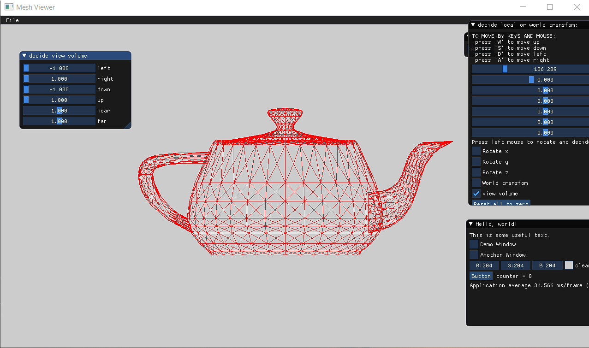

after changing view volume (changing down parameter):
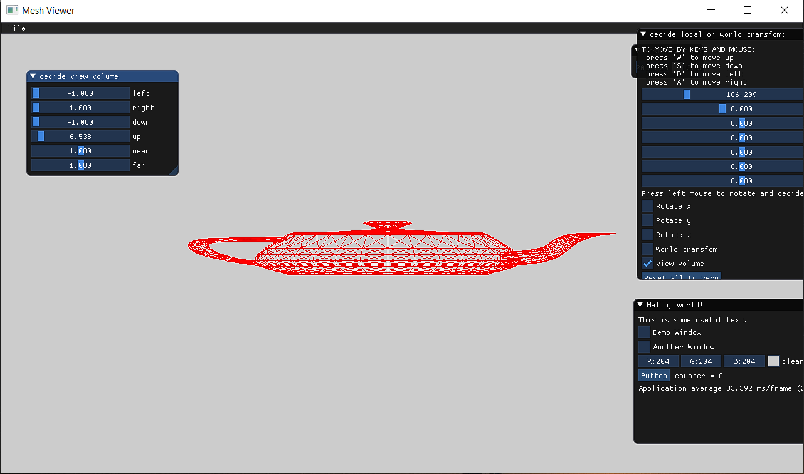

--------------------------part2--------------------

Than i implemented camera transformation by adding local and world sacle translate and rotate matrices and allowing the user controll them by sliders,than i multiply the model's vertices by the inverse of these transformations here we can see some example of moving camera local than rotating it in world:

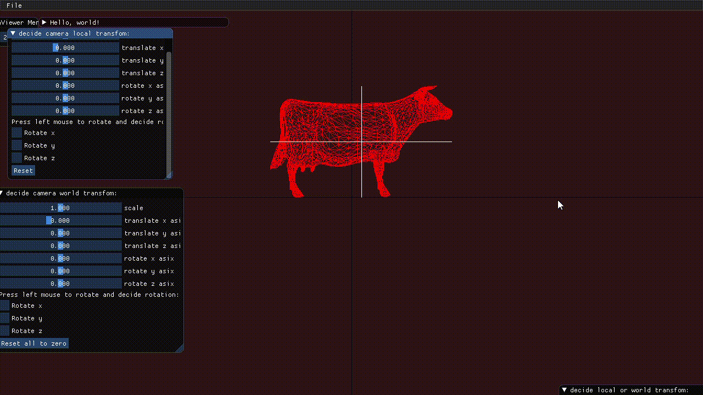

-------------------part3-----------------

By comparing the width and height of the object in both windows and making sure that the ratio is the same, i have verified that the proportions of the object remain the same in both window sizes. 
here is example of 2 different window sizes:
window 1920*1080:
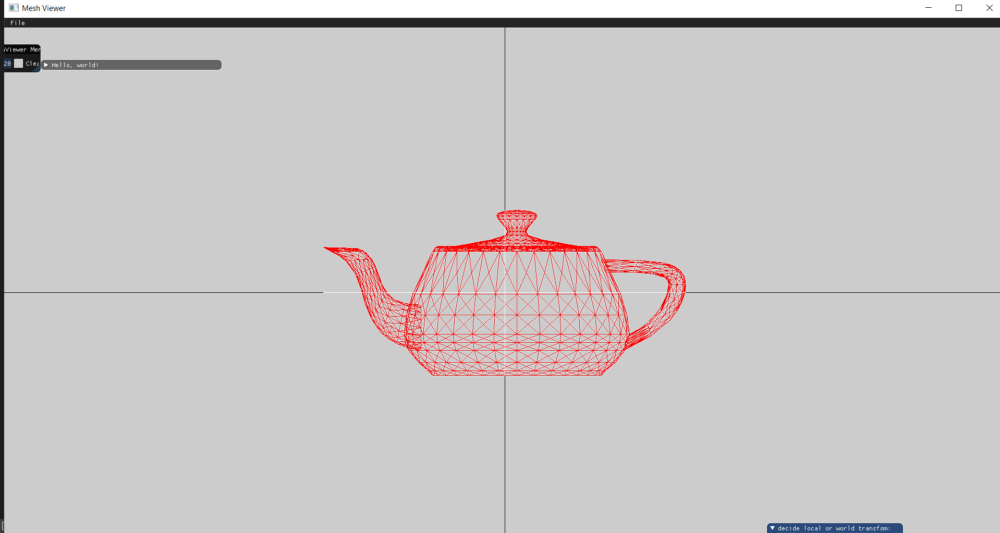

window 360*180:
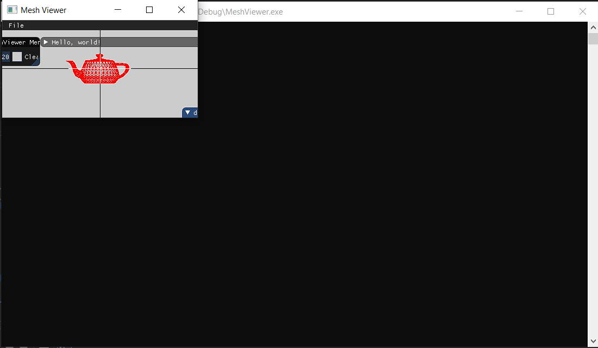

---------------------part4------------------

translate world x by 190 than local rotate z by 54:
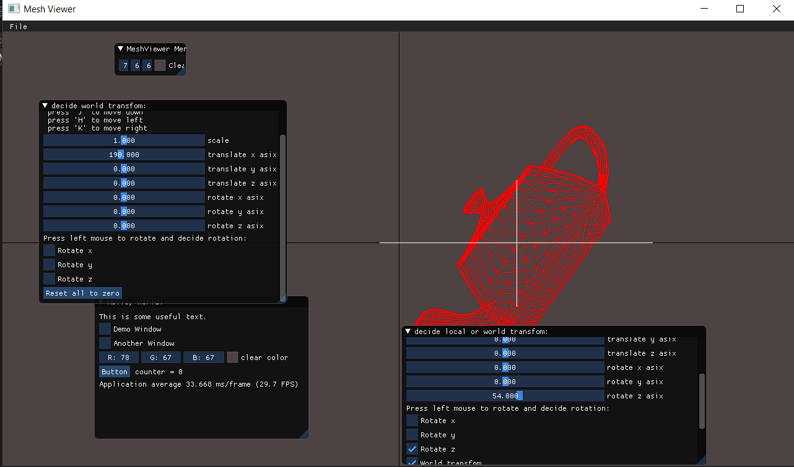

x translate local 190 than world z rotate by 54:
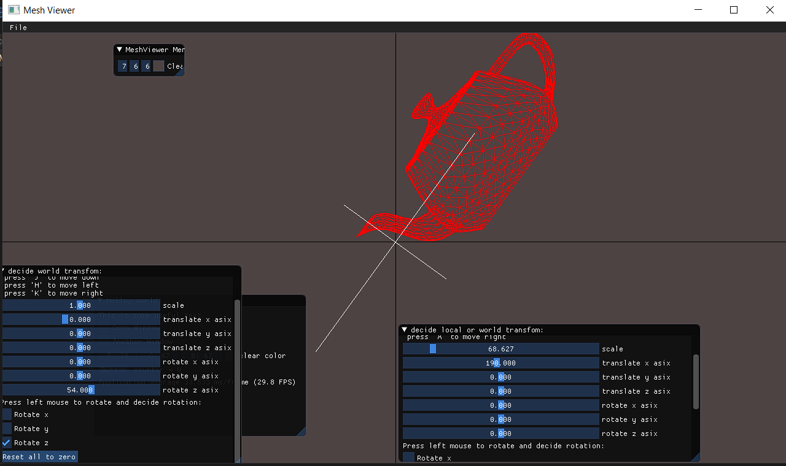

-------------------part5--------------------

T1=translate x asix by 0.250
T2=rotate x by 76

T1 local and T2 world:

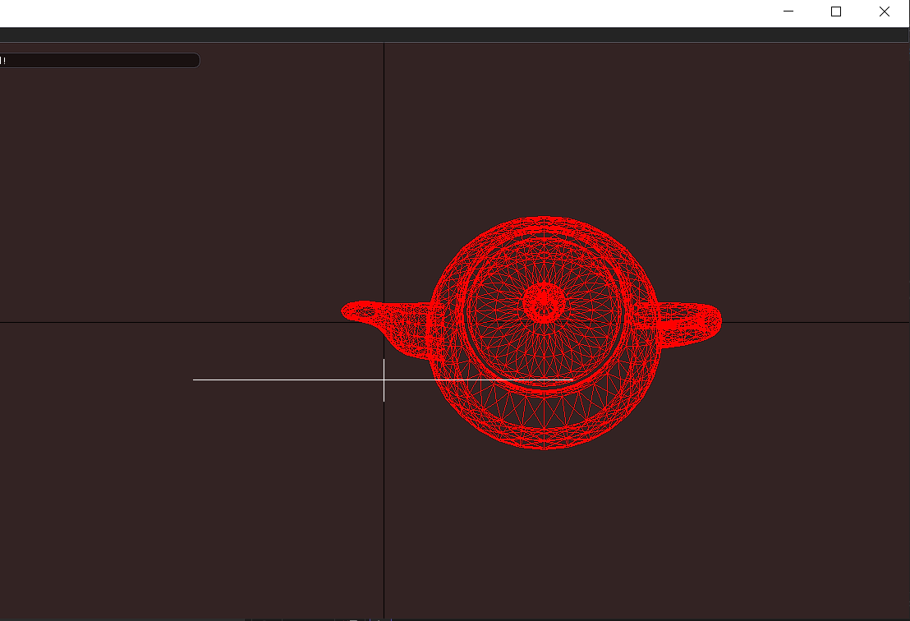

T1 local and T2world:

-------------------part6-------------------

to demonstrate the differnce i used world z roation on both:
local bounding box after transformation:

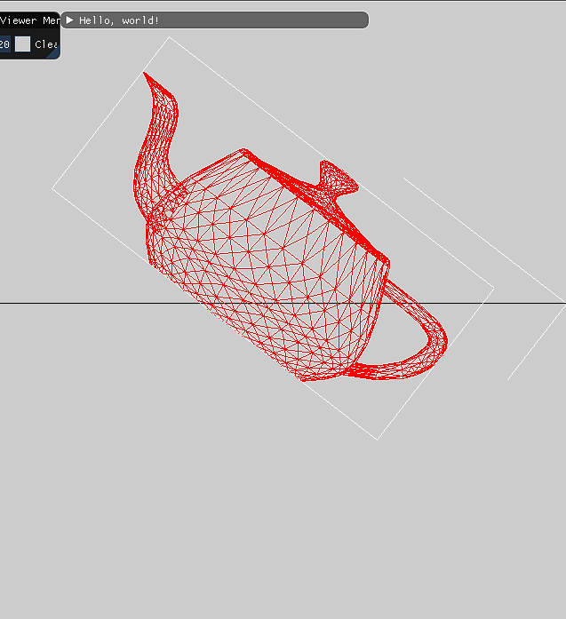
world bounding box after transformation:
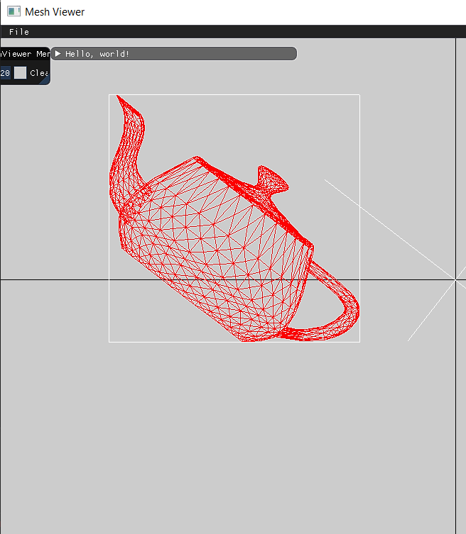

------------------part7--------------------

transformation and normals:

one sanity check i have used is to check that normal of a face is perpendicular to the face, and the normal of a vertex is an average of the normals of the adjacent faces.

----------------part8----------------

ortho projection:
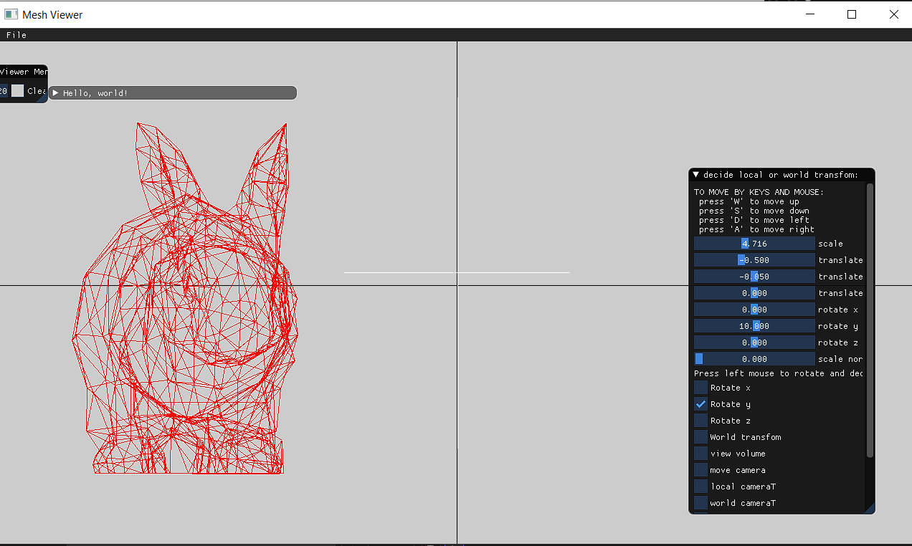

perspective projection:

we can see that the differnces are clearly visable, one way to check the correctness of a perspective projection is to visually inspect the result and apply to it translation of z objects that are farther away from the viewer should appear smaller than objects that are closer to the viewer.

-----------------part13-------------------
This part of assign 1 i have add bottom to show normals and option to controll their scalling,also bottom to add local and world bounding box.
i have added options to controll camera either by transformation or by placing the camere in other place by changing "look-at" function (with sliders and prameters a,b,c) as well i added option to controll the view volume and decide to choose between perspective and ortho projections.

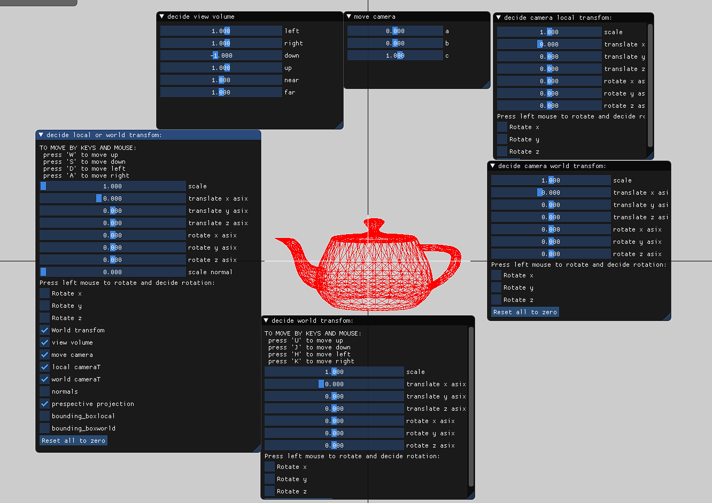