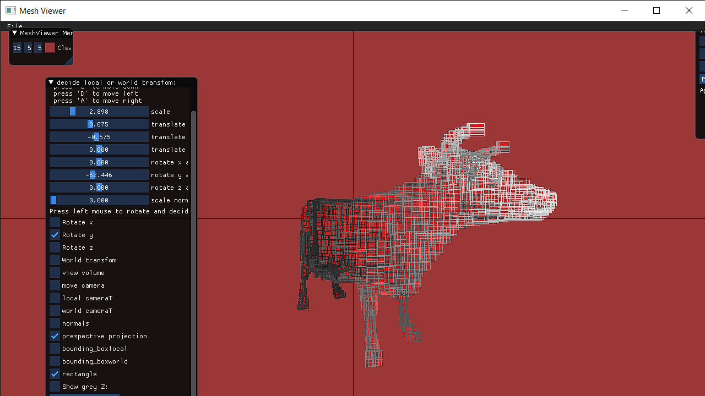
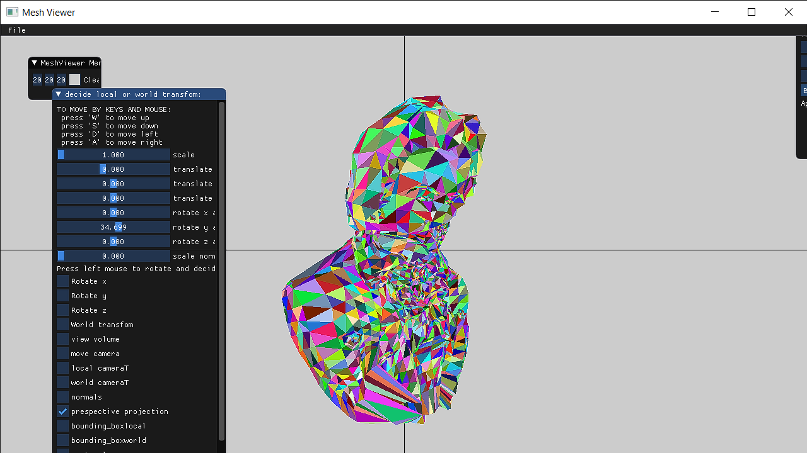
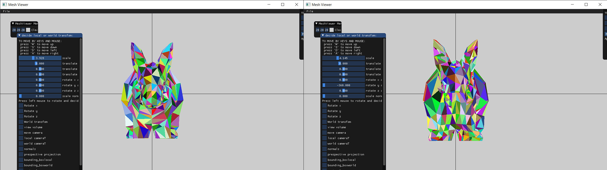
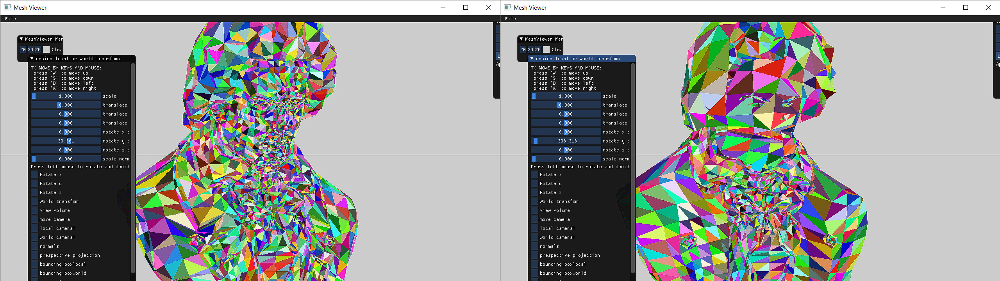
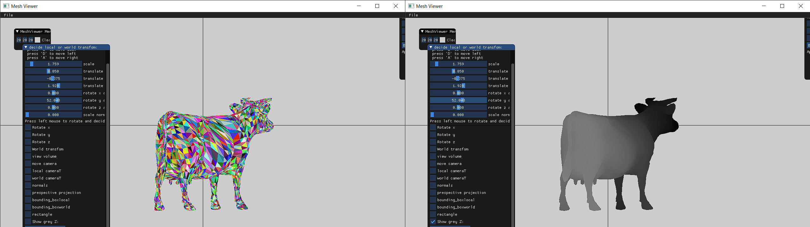

------------------------------------------part1-------------------------------------------------

For part 1 of drawing the bounding rectangels i found for each triangle the min and max (x,y)
and constructed the rectangles using them, after this i set the color like that:
for each triangle i took the avrage of z (z1+z2+z3)/3 and devided it by maxz+minz.
here is photo of the result:

------------------------------------------part3-------------------------------------------------

  Here i have implemented the edgewalking algorithem, the result:

------------------------------------------part4-------------------------------------------------

 Here i have implemented the Z buffer algorithem here are some results compering of color buffer without z buffer,
 colored with Z buffer and gray scale.
 For each example Left with z_buffer Right without so we can clearly see that no more overlap problem:

  Some results with grey color and colored:

