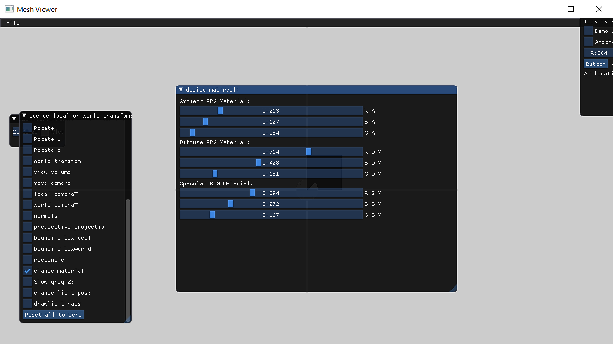
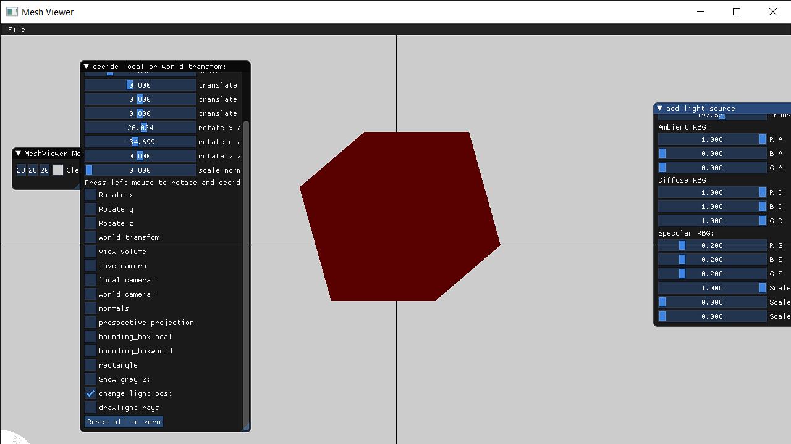
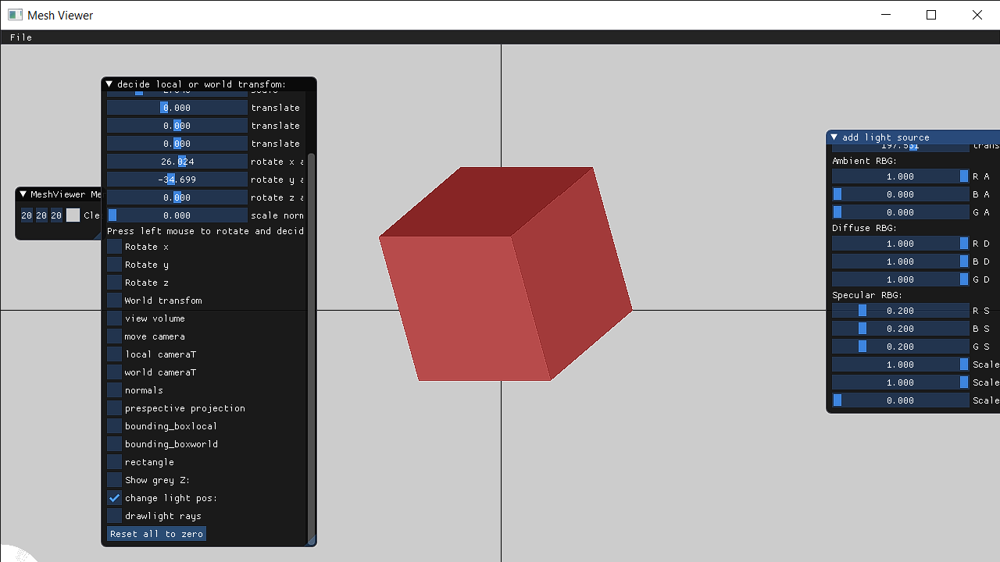
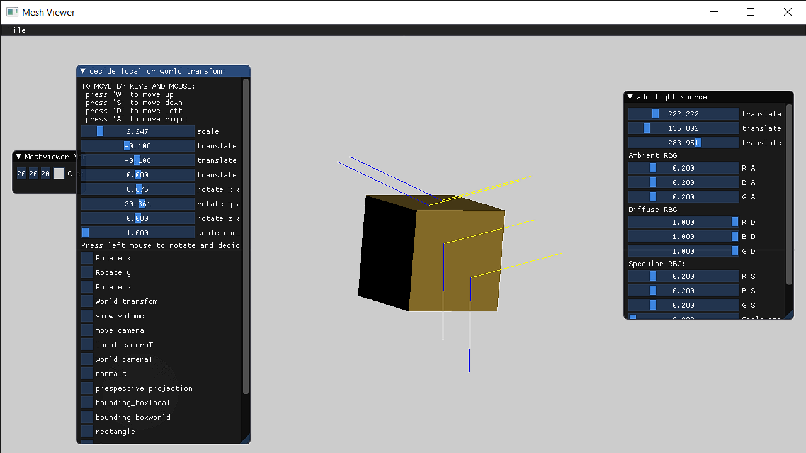
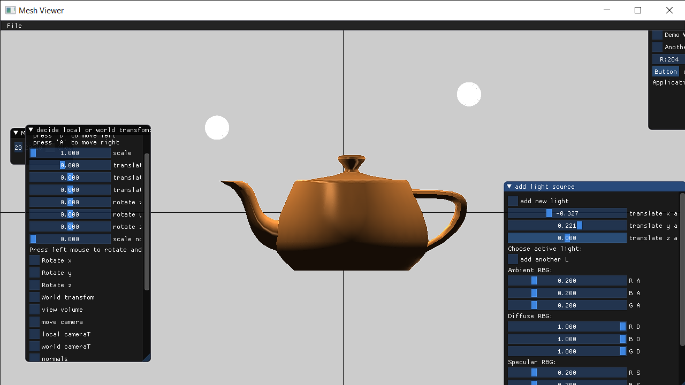
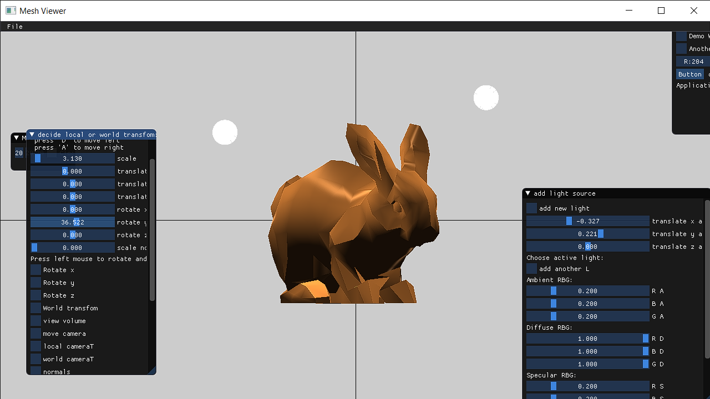
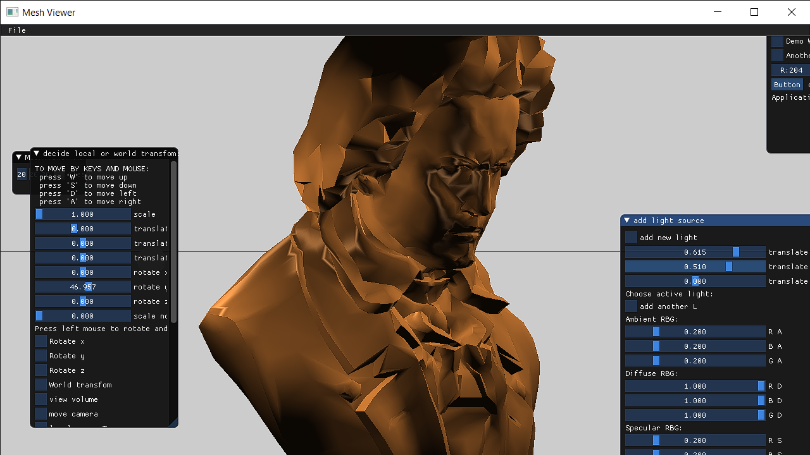

--------------------------part1--------------------------------------

for part1 i have added option to add light points and change model's
matirial. now each model holds struct calls "material" witch holds
3 glm::vec3 representing amabient specular and diffuse of the matiral.
here picture of how the user can change them:

after this i changed the model's color to be white and add some red ambient light, i used the white color so the model we will be able to clearly see the red color on the model here is the result:

------------------------------part2-----------------------------------------------

here i have implemnted diffuse light with flat shadeing on the same model the result:

-----------------------------part4-------------------------------------------------------

here i have implemented the specular light we can see the rays direction here:

-------------------------------------part5+6-------------------------------------------------

Im working alone so i have implemented only phong shading so here are some models and results:

