----------------------------part1-----------------------------------

Using the glGenTextures and glGenVertexArrays routines, the function generates a unique ID for each openGL texture and vertex array object.
Using the glBindVertexArray method, we bind the VAO buffer to openGL. This buffer is the one in use right now.
Data transport to the GPU is handled by the buffer buffer, but first we must allocate and bind the buffer using glGenBuffers, glBindBuffer, and glBufferData.
The data transmission is split into two sections and carried out in glBufferSubData and glBufferSubData.
Now, we use the InitShader method to load and compile the shaders. It is the responsibility of this function to associate openGL data with GLSL variables.
We must call the glUseProgram function with program in order to use this program (ID of program).
Using glGetAttribLocation and glGetAttribLocation, you can pass data to the shader (vertex position and texture coordinates) and instruct it where to look for those variables.
glEnableVertexAttribArray and glEnableVertexAttribArray are used to enable certain variables.
using glUniform1i to uniformly set variables.

----------------------------part3----------------------------------------------

Here is the vertex shader:

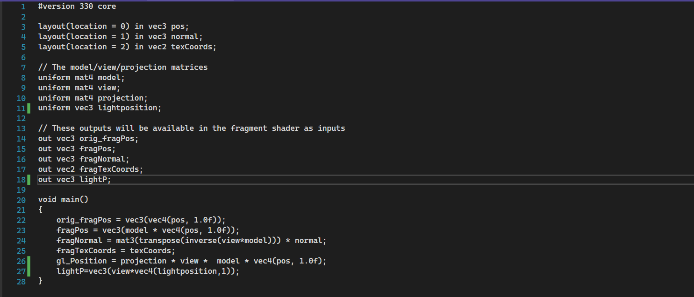

-----------------------------------------------part4+part5---------------------------------------------------------

Here i have implemented the fragment shader:

here we can see the object with only one color for now:

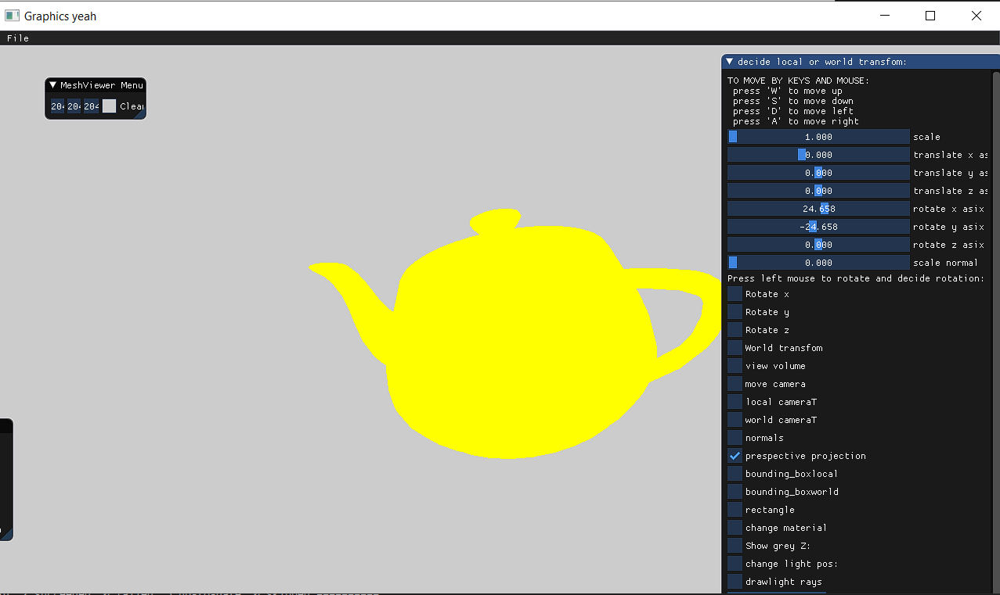

----------------------------------------part6----------------------------------------------------------

here i have implemented phong shading in the fragment shader so here are some results:

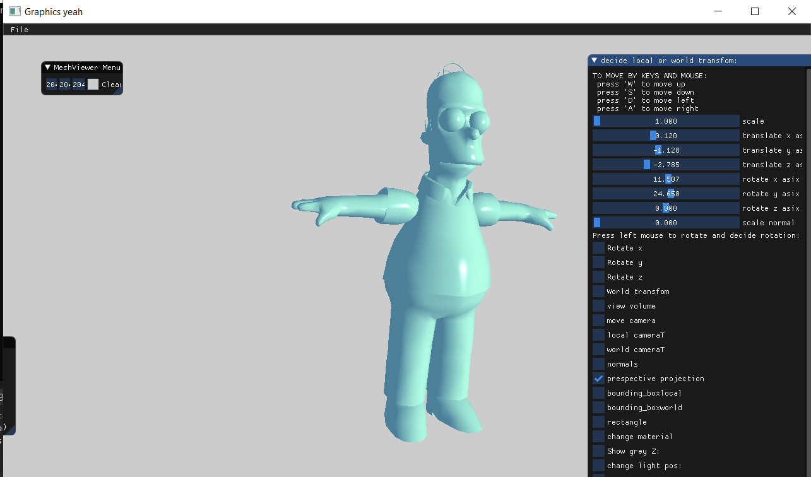

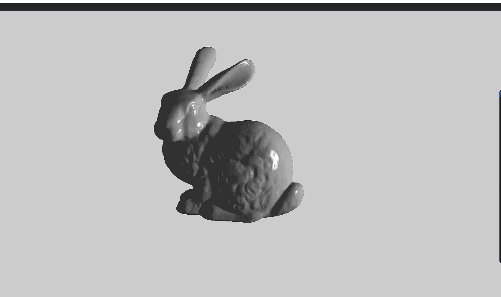

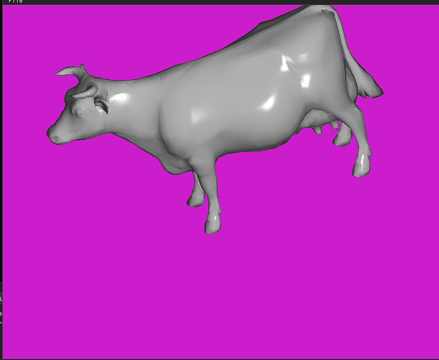

-------------------------------------------------part7--------------------------------------------------

For this part i have implemented "plane" texture mapping, here are some results:

here is teapot with bricks photo on it:

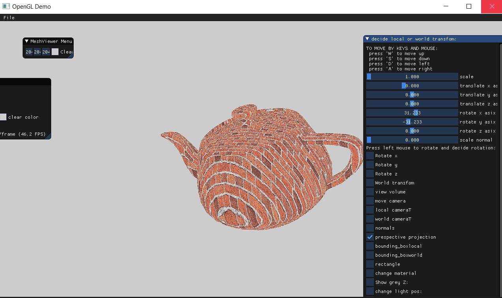

cow with camo on it:

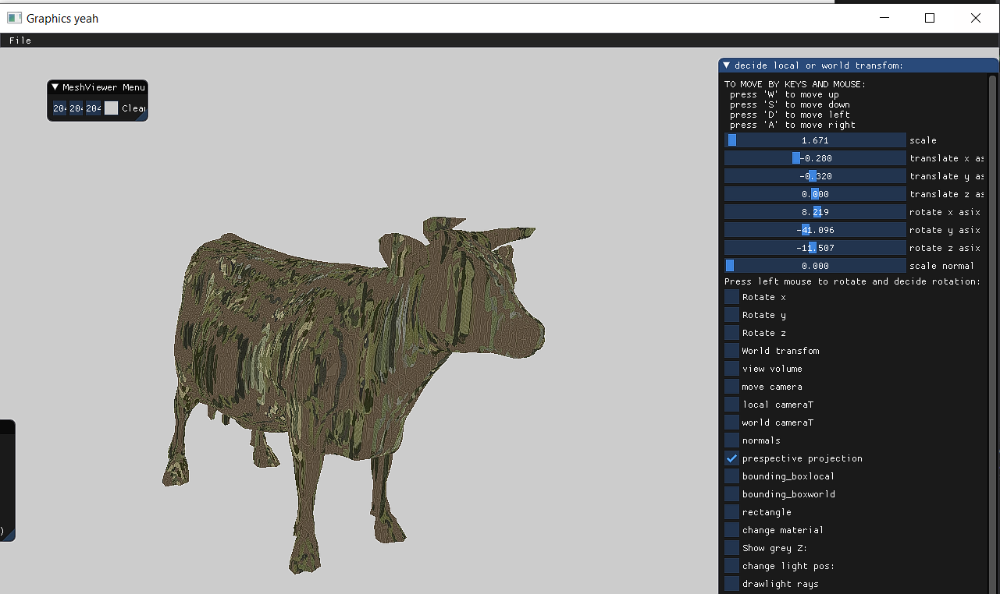

Here are some objects i found with texture cord and image that i liked:

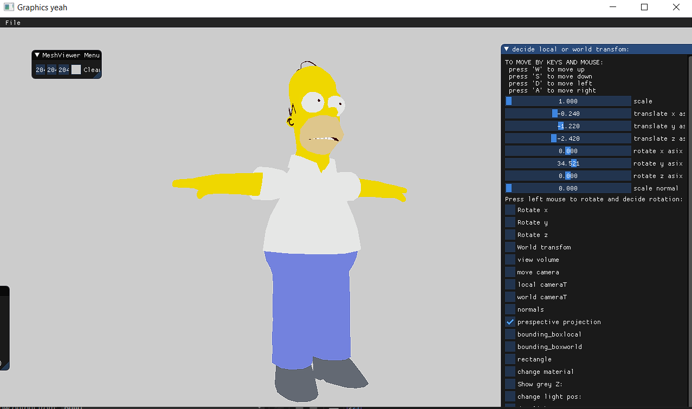

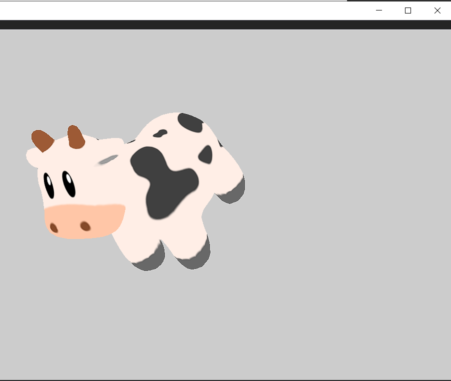

----------------------------------------------part8--------------------------------------------------------

for this part i have implemented toonshading here are some photos of it:

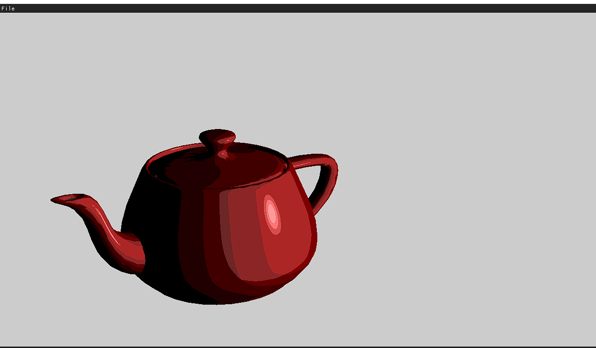

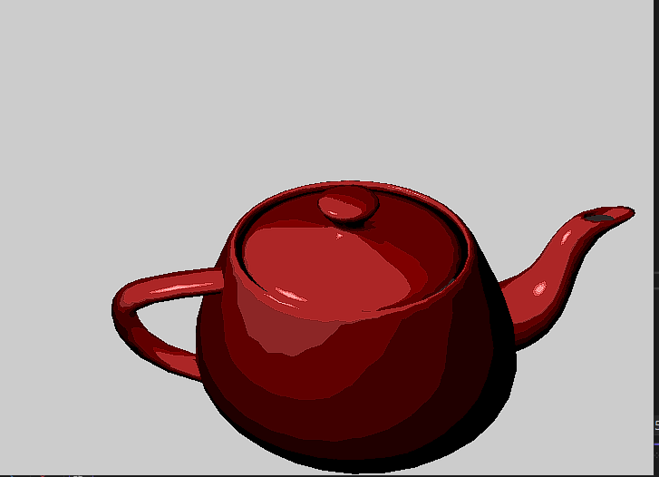

