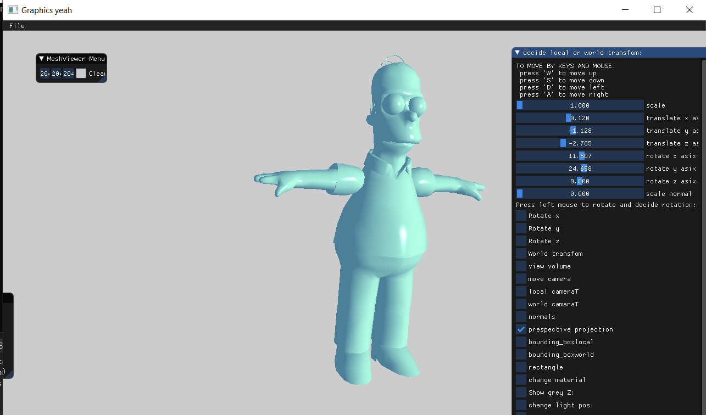
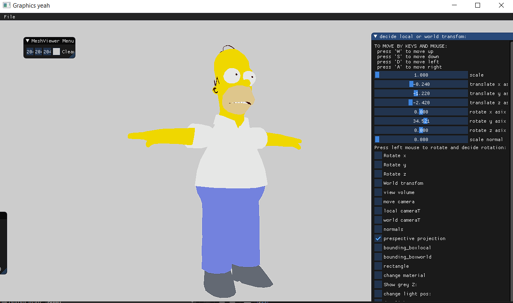
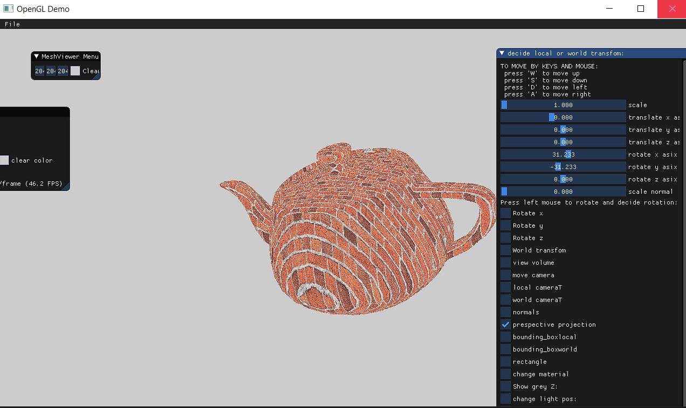

Computer graphics project:
 I used C++ and OpenGL to build an interactive scene for this project. 
 The user may edit models, add or delete textures, as well as control the camera, 
 light sources, and model movement and rotation, all through the user interface.
 Here are some images of the completed item:

